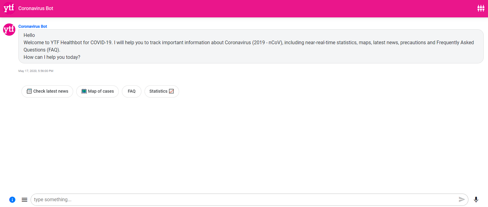

# [kelvin Mwaniki ](https://kelvin169.github.io/kelvinMwaniki/)
## Portfolio Projects
### Project 1. [Corona virus Bot ](https://webchat.snatchbot.me/2d7fac783f74a5e528703986d0d2702f01dd35233435a0c67ca9f5282e3b98af)

#### so the project initially started off as a way to convey credible information to the masses 
#### Our primary aim being to focus more on simplicity and efficiency so as to make it not just easy to use and equally effective.
#### But also efficient and effective  in its operation. The whole process and aim of the project was to create awareness.
#### It also helps ensure the correct information is shared.

## Project 2 . [FaceBook MessangerBot](https://www.messenger.com/t/ytfcoronavirusbot)

#### The facebook bot messanger was created with the intention to improve the interface as well 
#### As well as creating ease in the interaction with the bot.
#### The advantage of working with the facebook messenger was that it has more people accessing it
#### This also gives a more personal approach and feel to the interaction

## Project 3: [Golang NeuralNetwork](https://github.com/kelvin169/Golang-Neuralnet)
#### Creating Neural networks was exciting and enabled me to appreciate the capabilities of golang.
#### Turns out golang also has multiple use case scenarios as well as it is fit for many applications 
#### Machine learning is however not as widely used in golang seeing it does not have many supporting libraries
#### One of the core aim of the project is to also explore the various approaches Golang takes.

## Project 4: [E-commerce shoes store](https://github.com/kelvin169/Flutter-Adidas-Shoes-Ecommerce-App-UI)

#### Coming up with an eCommerce show store helped me explore the capabilities of using flutter for User interface design
####  The advantage of using flutter is that only a single code base is necessary and there is no need for additional software 
#### It is also fast and the fact that it entirely uses widgets means that it is great for various applications
#### Much of the online projects support various variations and in the process, we end up coming up with exciting projects.
#### Continuous improvement in my opinion is something very crucial

### Project 5 :[Python Automation](https://github.com/kelvin169/Python-Automation)
#### In the process of automating in python, I came across some pretty good use case scenarios.
#### One of the use case for automation is by taking away the mundane tasks more so in everyday activities.
#### The email project is largely an automated system that allows for frequent response
####  In the process you end up learning so much about python as a language.
####  This also goes with a lot of exposure to classes and procedures

### Project 6:[ Flutter UI Travel app](https://github.com/kelvin169/flutter_travel_ui)
#### When creating a flutter app , the use of widgets is extensive
#### The exciting thing about it is that there is no shortage of ideas that can be explored using the program. 
#### The advatage of rapid prototyping means a lot can be tried out within a given period of time,

### project 7 : [YouTubeClone](https://www.youtube.com/watch?v=aLLwKaxh98M) 
#### Yet another flutter based project 
#### So the only difference with this one is the measures taken are different
#### So the next major adjustment was making use of the widgets available. 
#### Also it was interesting deploying and adding new features

### Project 8:[Mpesa-Golang ](https://github.com/kelvin169/mpesa-api-go)
#### Just to give context this is not a personal project but something I have taken keen interest in 
#### Golang is a really interesting language to work with. 
#### Golang is efficient for backend
#### Soon to come will be a matlab clone And fast fourier transform

